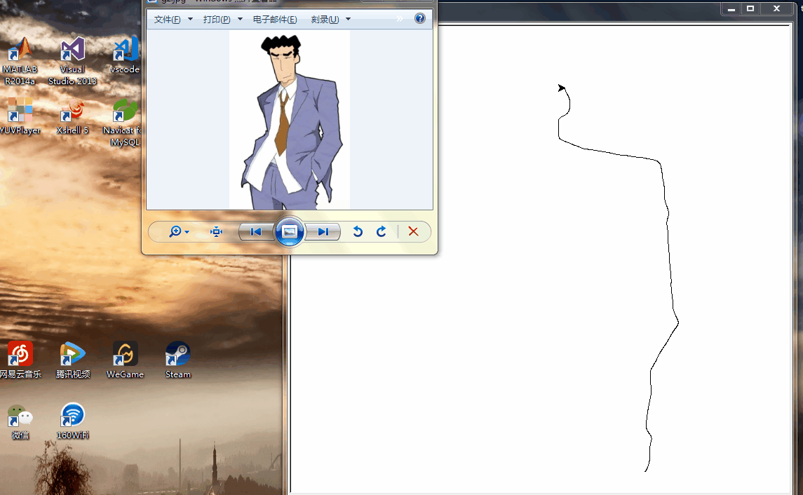

# Fundraw
提取图像边缘，并收集边缘线条，再【一笔一笔】绘制出来。


## 包依赖
* numpy
* scipy
* mkl
* scikit-img

## 接口
在命令行中采用如下格式进行调用，中括号中的参数是可选的。
```
>>fundraw.py  [<sigma>] [<speed>]
```
* img-path 待绘制图片地址。
* sigma 默认值为2。范围[0, 正无穷]，值越大，绘制图片细节越少；值越小，绘制图片细节越丰富。
* speed 默认值为10。范围[0, 10]，绘制速度，越大速度越快。

## FAQ
若抛出了`RuntimeError: maximum recursion depth exceeded`异常，请修改sigma参数后再试。